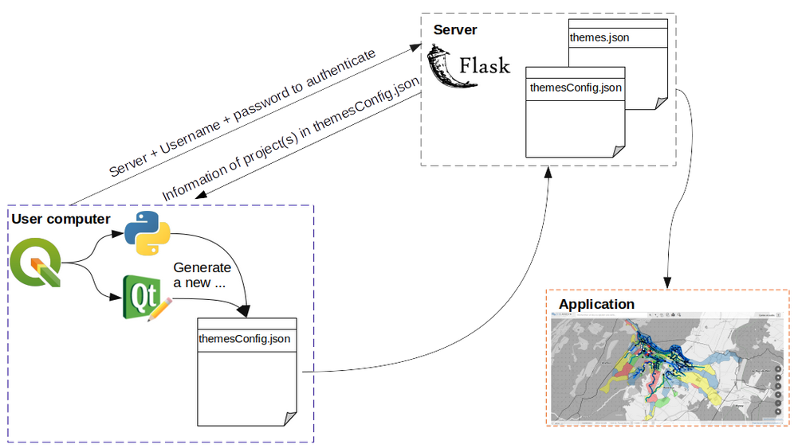
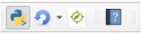
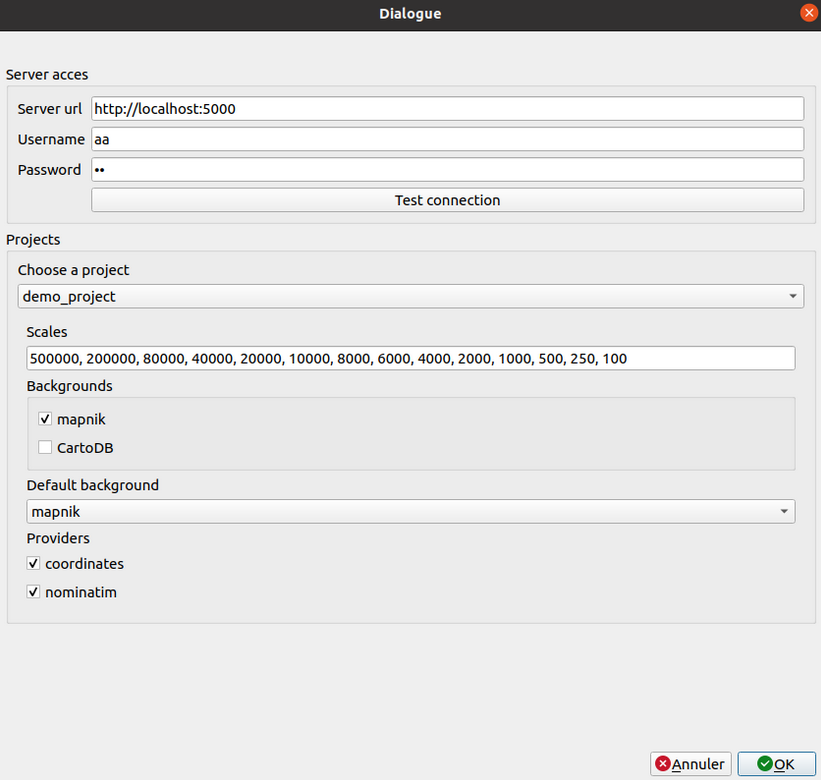

The QWC2 plugin allows to publish and update QGIS projects on the web from QGIS desktop.

The plugin has an associated server component that lives in the QWC2 microservices ecosystem.

Below is a blueprint of the architecture .



There are two prerequisites :

* To open the plugin window and add a new project in the application, it is necessary to have **a QGIS (.qgs) project opened in QGIS Desktop**. Once the window is opened the user can also configure projects that are already published. If the user only wants to modify an existing project, he must open it in QGIS Desktop to open the QWC2 plugin configuration window.

* The user also needs to know the url of the server, his/her username and password.

To a better understanding of what we realised, we propose here [a short video of the plugin](https://youtu.be/XK5nevc4D9g) : 

As you can see, the first step is to create and configure your project in QGIS Desktop : symbology, QGIS Server services.
After you click on the button a window appears where the user gives the url server, username and password. Clicking on "test connection" allows the connection to the server and add information about projects already in the app and the project you want to add in the interface. You can modify informaiton and then click `OK` to add the project in the application. After some minutes, the project is in the app! If you refresh your web page you can see the project and the symbology you choose.

# To test the plugin... how it works now

Clone this repository in the QGIS plugin folder: 

```
git clone <this repository> ~/.local/share/QGIS/QGIS3/profiles/default/python/plugins/qwc2_plugin
```

Run the server component locally:
```sh
cd  ~/.local/share/QGIS/QGIS3/profiles/default/python/plugins/qwc2_plugin
virtualenv -p python3 venv
. venv/bin/activate
pip install -r requirements.txt
python server.py
```

For now, there is a configuration file (the same as in [qwc-config-generator](https://github.com/qwc-services/qwc-config-generator)) defined in `server.py`. It is located in your QWC2 installation directory, for example, here `/opt/qwc2/qwc-services/config-in/default/tenantConfig.json`.

Open QGIS desktop, create a QGIS project, configure QGIS server services (WMS, WFS...), activate the plugin and click on the QWC2 icon in the plugin toolbar (the third one) 

The configuration dialog opens:



It is divided in two parts:

* in the authentication part, the user completes the required information to connect to the server. The user clicks on *test connection* to check url and credentials and get the current configuration.
* in the project part, updated information about projects from the `tenantConfig.json` is displayed. The default displayed project is the one currently opened in QGIS. The user can switch on all projects already on the server and configure them one by one: scales, background, default background and searchproviders. When the user clicks on **ok**, new configuration is sent to the server and qwc-config-generator generates new files.

We created a micro service with Flask to :
* connect plugin to QWC2 application
* copy QGIS project on the server
* update configuration of qwc-config-generator
* generate new configuration, thanks to qwc-config-generator

Also, thanks to `server.py`, you can download zip file of the `plugin` directory to install it in QGIS. For example, you can download it at [https://qgisweb.oslandia.net/plugin/download](https://qgisweb.oslandia.net/plugin/download).

# Way to improve it... how it will work

Some improvements that we can think of after that:
* control if QGIS Server services in the project are activated,
* transfer layers symbols to the server (e.g. in case of custom svg symbols)
* transfer datasources (shapefiles, geopackages) to the server if the data used by the project is not already available "online" (note: the server typically hosts a PostGIS server)

# Talk about it ...

We already talk about this plugin in [the mailling list QWC2](http://osgeo-org.1560.x6.nabble.com/New-features-in-QWC2-td5434695.html) and in [an issue on github](https://github.com/qgis/qwc2-demo-app/issues/3). 

Feel free to add comments or/and suggest changes.
